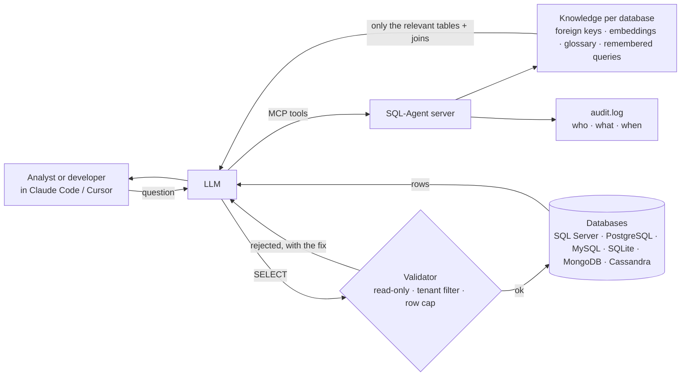

# SQL-Agent — ask your database questions from Claude Code

[](https://github.com/Machi2130/SQL-Agent/actions/workflows/tests.yml)


An MCP server that gives an AI assistant (Claude Code, Claude Desktop, Cursor) a
**governed, knowledge-backed connection** to databases: it learns each database once,
hands the model only the tables a question needs, enforces read-only access, and audits
every query. Supports SQL Server, MySQL/MariaDB, PostgreSQL, SQLite, MongoDB and Cassandra.

## Why this exists

Large language models are good at writing SQL and poor at three things that matter the
moment they touch a real database:

- **Context.** A production schema has hundreds of tables. A model that receives the
  whole schema spends most of its context budget on irrelevant tables and still guesses
  the joins; a model that receives nothing hallucinates table names. Neither knows that an
  opaque column such as `Account_Ref` holds the customer's card number.
- **Safety.** Nothing in the model prevents an `UPDATE`, a `SELECT INTO`, a query that
  returns fifty million rows, or — in a database shared by twenty clients — a total that
  silently mixes their data.
- **Governance.** Generic MCP database connectors are thin wrappers: one shared
  credential, no record of who ran what, no separation between users.

SQL-Agent addresses each one. A per-database **knowledge layer** (real foreign keys,
schema embeddings, a human glossary, remembered question→SQL pairs) reduces the context a
question needs by about 10× and removes join guessing. A **validation layer** enforces
read-only SQL, a row cap and a mandatory tenant filter, and routes any data change through
a human confirmation step. A **governance layer** provides per-user tokens, isolated
knowledge per user, and an audit line for every statement. The result is a database
connection an organisation can hand to an AI assistant without handing over the keys.



## Setup (once per machine, ~5 minutes)

1. **Python 3.12** and **Git**.
2. Clone and install:
   ```
   git clone https://github.com/Machi2130/SQL-Agent.git
   cd SQL-Agent
   pip install -r requirements.txt
   ```
3. **SQL Server only:** install *ODBC Driver 17 for SQL Server*.
   - Windows: Microsoft's installer (search "ODBC Driver 17 for SQL Server download").
   - macOS: `brew tap microsoft/mssql-release && brew install msodbcsql17`
4. Create your own `.env`:
   ```
   cp .env.example .env
   ```
   Fill in `GROQ_API_KEY` (your own key — needed for natural-language questions)
   and, optionally, `MCP_DB_PASSWORD` so the database password is not entered on every
   connection (or one per database, `MCP_DB_PASSWORD_<DBNAME>`, when several servers are used).
   Everything else can stay as is. **Never commit `.env`.**
5. Register the server with Claude Code (use the absolute path to `mcp_server.py`;
   on macOS use `python3`):
   ```
   claude mcp add sql-agent -s user -e PYTHONUTF8=1 -e MCP_USER_ID=<your-name> -- python /full/path/to/SQL-Agent/mcp_server.py
   ```
   Check it: `claude mcp list` should show `sql-agent … ✔ Connected`.
   The first start downloads an ~80 MB embedding model.

## Use

Start `claude` in any folder and ask, for example:

> connect to SQL Server db.example.com, database SalesDB, as reporting_user, and find the customer with this mobile number

If the connection details are not supplied, Claude Code shows a form asking for
host, port, username, password and database — the password goes straight to
the server, never through the chat. On the first connect to a database the
server learns its schema (a minute or two on big schemas); later connects are instant.

How a question is answered when Claude is the client: on connect the server builds a
knowledge graph of the database (table/column embeddings + relationships, no LLM).
`get_query_context(question)` then returns just the relevant tables, their join paths,
business notes and similar past queries — a few hundred tokens instead of the whole
schema — Claude writes the SELECT, and `run_sql` executes it and remembers the
question→SQL pair. Groq is only used by `query_database` (the web app / clients
without a strong model).

Join paths come from the database's real foreign keys when it has them (read once per
connect), with name-based inference only filling gaps.

**Teach it once.** Facts the schema cannot express — "`ACCOUNT_LINK.Account_Ref` is the
card number", "amounts are in local currency" — go in as glossary notes:
`add_note(note, table?, column?)`. They're stored with your private knowledge of that
database, shown only when a question touches that table, and used to pick tables (ask
about "card" and that table comes in). `list_notes` / `delete_note` to manage them.

**One database, many clients.** If the schema shares a column across most tables
(`Tenant_Id`, `Client_Id`…), `connect_database` reports it as a *scope candidate*. Set it
once per connection — `set_scope(column="Tenant_Id", value="7", label="Acme Retail")` — and
every query on those tables must filter on it or it is rejected with the exact clause to add,
so clients' data is never mixed by accident. Empty value clears it.

**It learns what matters.** `import_query_history` reads the database's own execution
statistics (which tables the application and team query most) and `import_queries` ingests
the SQL people already have; `run_sql` keeps counting. Popular tables rank first and show as
`hot_tables`, so `orders` wins over a stale `orders_archive` by default.

Tools: `connect_database`, `get_query_context`, `get_schema`, `run_sql` (SELECT/WITH
only — INSERT/UPDATE/DELETE/DDL are rejected), `execute_write` (developer mode),
`add_note` / `list_notes` / `delete_note`, `query_database` (Groq writes the SQL),
`explain_query`, `suggest_chart`, `upload_document` / `search_documents`, `disconnect`.

## Safety: read-only by default, developer mode on request

- `run_sql` / `query_database` are strictly read-only (SELECT/WITH only, one statement, no
  `SELECT INTO`, blocked keywords), capped at `MCP_MAX_ROWS` rows (default 5 000; the result says
  `truncated: true` when there was more). For real protection use a **read-only database login**
  (`db_datareader`) for the server — the SQL guard is the second line, not the first. SQL Server:
  ```sql
  CREATE LOGIN sql_agent_ro WITH PASSWORD = '<long-random-password>';
  USE [YourDatabase];
  CREATE USER sql_agent_ro FOR LOGIN sql_agent_ro;
  ALTER ROLE db_datareader ADD MEMBER sql_agent_ro;
  ```
  Repeat the `USE … CREATE USER … ALTER ROLE` block per database the agent should read.
- Developers who need to change data use **`execute_write`**: the server must set
  `MCP_ALLOW_WRITES=true`, the connection must be opened with `allow_writes=true` (using the
  developer's own write-capable credentials), every statement is shown to the user in a
  confirmation form, `UPDATE`/`DELETE` need a `WHERE`, and DDL needs `MCP_ALLOW_DDL=true`.
  `dry_run=true` executes inside a transaction, reports rows affected, and rolls back — use it first.
- Every query and write is appended to `audit.log` (JSON lines: who, connection, SQL, rows,
  duration, outcome). Give each person their own token (`MCP_AUTH_TOKENS`) so "who" is a name.

## Several databases at once

Connections stay open. Connect to DB1, work, connect to DB2 — DB1 is still open;
say "switch back to DB1" and it's instant (no reconnect, no re-learning). Each
database keeps its own schema knowledge. `disconnect` closes only the current one,
and `describe_capabilities` lists what's open. Databases on the *same* SQL Server
instance can also be joined in one query with three-part names (`[OtherDB].dbo.Table`).

## Hosting it for a team (nobody installs anything, code stays on the server)

Run the server once, inside the network that can reach your databases, and let
people connect over HTTP.

```
# on the host (after setting MCP_AUTH_TOKEN and GROQ_API_KEY in .env):
python mcp_server.py --http 0.0.0.0:8000
#   or
docker build -t sql-agent . && docker run -d --name sql-agent -p 8000:8000 \
    --env-file .env -v sql-agent-knowledge:/app/.chroma_data sql-agent
```

Each colleague then runs one command — no Python, no drivers, no model download:

```
claude mcp add --transport http sql-agent http://<host>:8000/mcp --header "Authorization: Bearer <MCP_AUTH_TOKEN>"
```

**Everything is per person.** Each user's connections, learned schema knowledge,
glossary notes, remembered queries and usage counters are private to them — nothing is
shared between users, even on a team instance. Identity comes from the token, so give
every person their own entry in `MCP_AUTH_TOKENS` (a shared `MCP_AUTH_TOKEN` would make
everyone the same user). DB credentials are entered per person through the connection
form (or set `MCP_DB_PASSWORD_<DB>` on the host if everyone should use one account). Put
the server behind HTTPS (any reverse proxy) if it's reachable beyond your VPN, and remove
a person's token line to revoke access.

## Repository layout

```
mcp_server.py            launcher: python mcp_server.py [--http host:port]
sql_agent/
  server.py              MCP tools, connections, knowledge wiring, validation gates, audit, transports
  app.py                 shared engine: schema fetch, retriever, SQL validator, Groq prompts
  knowledge.py           RAG store + relationship graph + business-context cache
  query_planner.py       intent/time-range detection for the Groq path
  docstore.py            uploaded documents (chunk, embed, hybrid search)
  cache.py               sessions and caches (Redis, in-memory fallback)
  storage.py, auth.py    persistence and auth helpers
tests/                   pytest suites (run on every push)
docs/                    ARCHITECTURE.md · SECURITY.md · EXAMPLES.md
Dockerfile               hosted deployment
```

Design: [`docs/ARCHITECTURE.md`](docs/ARCHITECTURE.md) · threat model and guards:
[`docs/SECURITY.md`](docs/SECURITY.md) · real sessions: [`docs/EXAMPLES.md`](docs/EXAMPLES.md).
Tests: `python -m pytest tests -q`.

## Notes

- In local (stdio) mode knowledge is stored under `.chroma_data/` in the project folder and is not shared.
- Redis is optional; without it sessions live in memory for the life of the server process.
- `app.py` holds the shared query engine (schema retrieval, validation, Groq prompts); the
  companion web UI is not part of this repository.
