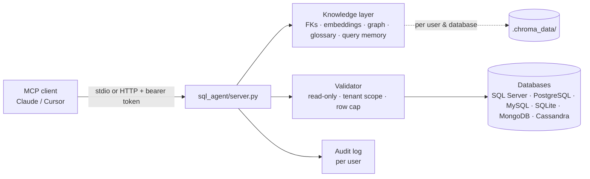
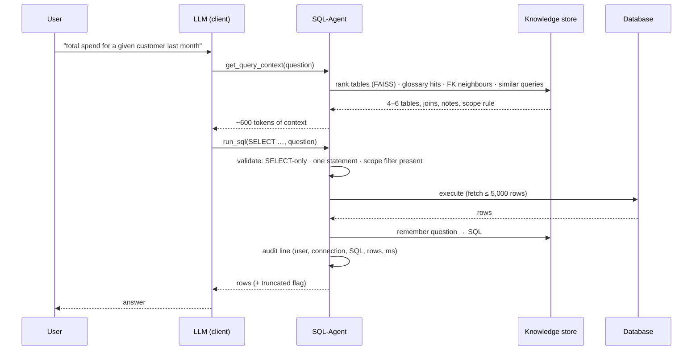
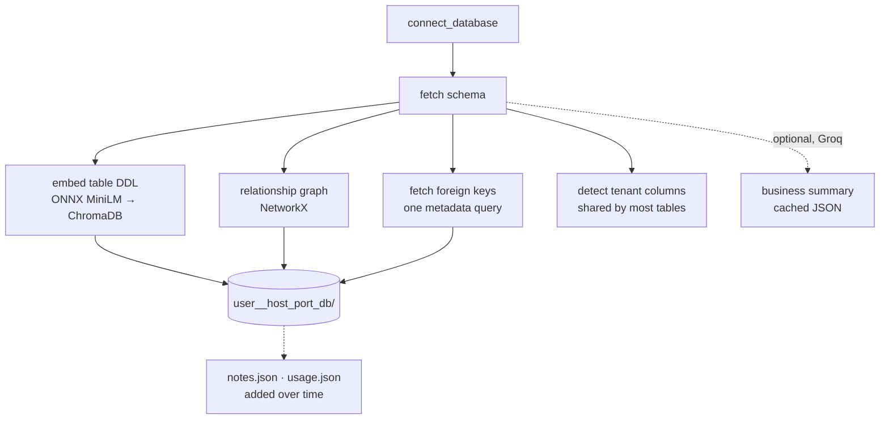

# Architecture

SQL-Agent is an MCP (Model Context Protocol) server. The client — Claude Code, Claude
Desktop, Cursor — brings the language model; this server brings governed access to
databases plus the knowledge the model needs to query them well.

## Request flow

1. **`connect_database`** opens a connection (or switches to one already open — several
   stay open side by side), fetches the schema and the real foreign keys, and builds the
   knowledge layer for that user + database: table DDL embeddings (ONNX MiniLM, in
   ChromaDB), a NetworkX relationship graph, and — if a Groq key is present — a one-off
   business summary cached as JSON. Multi-client databases are detected (a column shared by
   most tables) and reported as `scope_candidates`.
2. **`get_query_context(question)`** returns only what the question needs: 4–6 ranked
   tables with columns, join paths (FKs first, then graph, then `x_id → x.id` inference),
   glossary notes for those tables, hot tables, similar past question→SQL pairs and the
   active tenant scope. ~600 tokens instead of a 6,000-token schema dump.
3. The client's model writes SQL; **`run_sql(sql, question)`** validates it (SELECT/WITH
   only, blocked keywords, one statement, scope filter present), executes with a row cap,
   audits it, and remembers the question→SQL pair for next time.
4. **`execute_write`** (developer mode only) runs one INSERT/UPDATE/DELETE after the human
   confirms it in a form; `dry_run` reports affected rows and rolls back.

One question, end to end:

Knowledge build on first connect (no LLM tokens unless a Groq key is set):

## Modules

| Module | Responsibility |
|---|---|
| `sql_agent/server.py` | MCP tools, connection registry, knowledge wiring, validation gates, audit, stdio + HTTP transports |
| `sql_agent/app.py` | Shared engine: schema fetch, `SchemaRetriever` (FAISS + BM25 over table summaries), `validate_sql`, Groq prompts, join inference |
| `sql_agent/knowledge.py` | `KnowledgeEngine`: ChromaDB RAG store (DDL, docs, queries), relationship graph, business-context cache |
| `sql_agent/query_planner.py` | Intent/time-range detection and compact prompt plans for the Groq path |
| `sql_agent/docstore.py` | Uploaded documents: chunking, embedding, hybrid search |
| `sql_agent/cache.py` | Sessions, schema cache and query cache — Redis with in-memory fallback |
| `sql_agent/storage.py`, `auth.py` | Memory persistence and web-app auth (only used by the companion UI) |
| `mcp_server.py` | Root launcher: `python mcp_server.py [--http host:port]` |

## Keys and isolation

- **Connection key** = `session + host + port + database` (hashed when long). Engines,
  schema, retriever, FKs, scope and knowledge handle hang off it; a session's *current*
  connection is a pointer, so switching never reconnects.
- **Knowledge key** = `user + host + port + database`. Everything learned — embeddings,
  glossary notes, remembered queries, usage counts — is private to the user who learned it
  (user = token name over HTTP, `MCP_USER_ID` locally).
- **Documents** (`upload_document`) are per user, not per database.

## Transports

- **stdio** (default): one process per client, launched by the MCP host.
- **HTTP** (`--http host:port`): Streamable HTTP at `/mcp`, bearer tokens from
  `MCP_AUTH_TOKENS` (one per person) checked in plain ASGI (no redirects, constant-time
  compare); each client gets its own session from the transport's `Mcp-Session-Id`.

## Decisions worth knowing

- **ONNX embedder instead of sentence-transformers/torch** — same `all-MiniLM-L6-v2`
  vectors, 750 MB less install, 3× faster startup.
- **Table ranking uses FAISS, not ChromaDB's index** — Chroma's HNSW segment is not
  persisted for collections under ~100 records (i.e. every real schema), so a query from
  a fresh process could fail silently. Chroma still stores DDL/docs/query memory.
- **Connections are never closed on switch** — developers work across several databases;
  `disconnect` closes only the current one.
- **Writes require a human** — the model cannot approve its own statement; without a form
  the write is refused.
