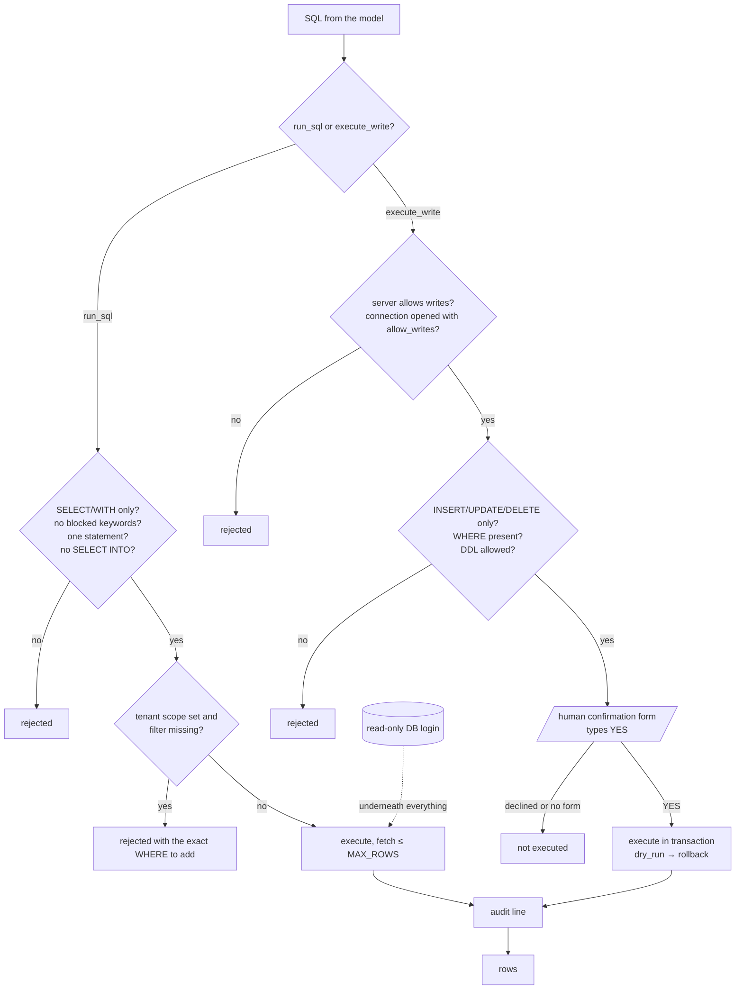

# Security model

The server sits between an AI model and real databases. The model is treated as an
untrusted author of SQL; everything below exists to make that safe.

## 1. The database login is the real guarantee

Run the server with a **read-only login** (`db_datareader` on SQL Server, a read-only role
elsewhere). The SQL validator is the second line of defence, not the first. Script for SQL
Server in the README. Never run the server under a sysadmin or database-owner account.

## 2. Read-only validator (`validate_sql`)

Applies to `run_sql` and the Groq path:

- statement must start with `SELECT` or `WITH`; CTE names are recognised as valid tables;
- blocked keywords anywhere: `INSERT UPDATE DELETE MERGE DROP ALTER CREATE TRUNCATE EXEC
  EXECUTE GRANT REVOKE DENY xp_* sp_* OPENROWSET OPENQUERY OPENDATASOURCE BULK DBCC
  BACKUP RESTORE SHUTDOWN RECONFIGURE WAITFOR`;
- `SELECT … INTO` is rejected (it creates a table);
- one statement per call (`;` rejected);
- table names must exist in the learned schema; sensitive column names are blocked;
- the user's question wording never licenses a write (an earlier version allowed a keyword
  if the question mentioned it — removed).

## 3. Row cap

`run_sql` fetches at most `MCP_MAX_ROWS + 1` rows (default 5,000) and flags `truncated`;
a `SELECT *` on a 50-million-row table cannot exhaust the server's memory.

## 4. Tenant scope

Many databases hold several clients in the same tables (`Tenant_Id`, `Client_Id`…). The
server detects such columns and, once `set_scope(column, value)` is called for a
connection, rejects any query on a scoped table that does not filter on that column — with
the exact clause to add. Clearing the scope is explicit. Mixing clients by accident is
the most expensive wrong answer this tool could give; it is blocked, not warned.

## 5. Developer writes (`execute_write`)

Three independent gates, all required:

1. server flag `MCP_ALLOW_WRITES=true` (keep it off on shared/analyst instances);
2. the connection was opened with `allow_writes=true` using the developer's own
   write-capable credentials;
3. a human types **YES** in a confirmation form showing the exact statement and database —
   the model cannot approve it, and a client without forms cannot write at all.

Plus: `UPDATE`/`DELETE` without `WHERE` are rejected; DDL needs `MCP_ALLOW_DDL=true`;
`dry_run=true` runs in a transaction and rolls back; the query cache is cleared after a
write.

## 6. Audit

Every `run_sql`, `query_database`, `execute_write`, note and scope change appends a JSON
line to `audit.log`: timestamp, user, connection, SQL, rows, duration, outcome, reason.
Give each person their own token so "user" is a name.

## 7. Authentication and isolation (hosted mode)

- Bearer tokens (16+ random chars) per person in `MCP_AUTH_TOKENS`; compared in constant
  time; checked before any routing, so no redirect can bypass it.
- Each person's knowledge (embeddings, notes, query memory, usage) is isolated by token
  identity. A shared token collapses all users into one identity and must not be used.
- Put HTTPS in front (Caddy/nginx) wherever the server is reachable beyond a trusted LAN.
- Revoke by removing the token line and restarting.

## 8. Secrets

`.env` is git-ignored and never read by the agent; passwords reach the server through the
connection form (client → server only, never through the model's context) or through
`MCP_DB_PASSWORD[_<DB>]` on the host. Nothing secret is logged — the audit log records SQL,
not credentials.

## Known limits

- A query that hits the client-side timeout keeps running on the database server.
- Elicitation (the confirmation/connection form) requires an MCP client that supports it
  (Claude Code ≥ 2.1.76); older clients get a clear "pass the fields as arguments" error
  for connections and are refused for writes.
